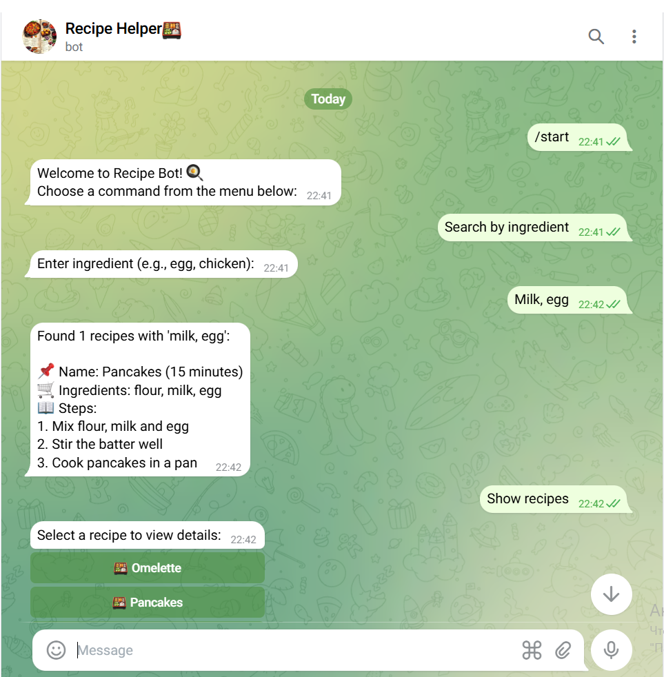
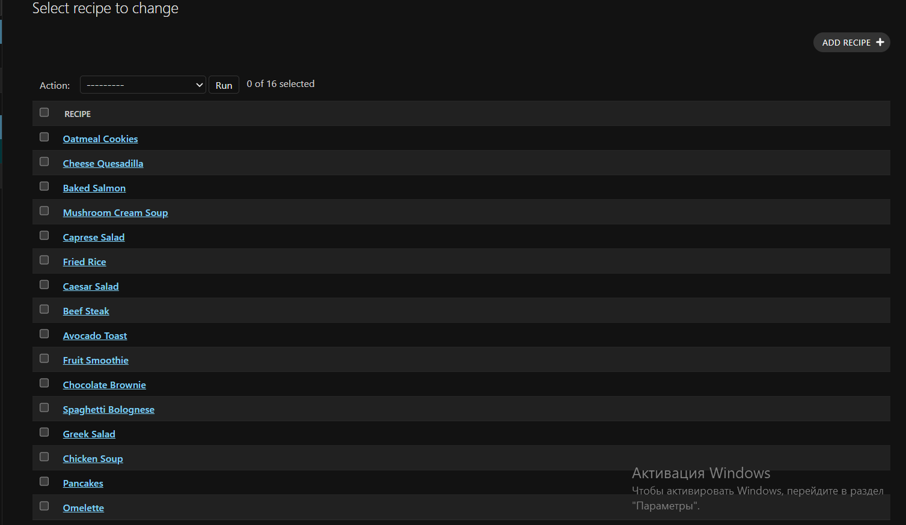
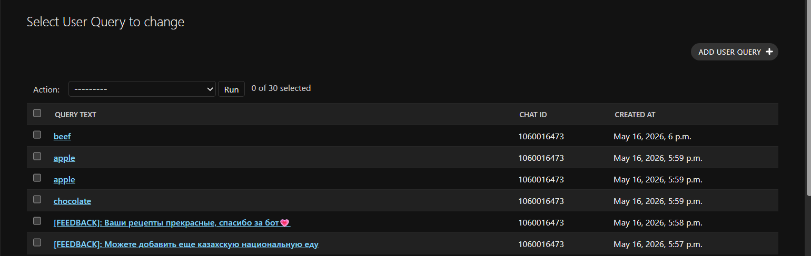

# 🍳 Recipe Bot (Hybrid Chatbot)

## 1. Project Title and Description
**Recipe Bot** is a hybrid Telegram chatbot designed to automate the search for food recipes by ingredients or categories. 
The main feature of this project is its hybrid architecture (Telegram Interface + Web Admin Panel + Database). All recipes are stored in an SQLite database and managed through the Django web administration panel. The bot also collects user query analytics (message history) and stores them in the database for further analysis.

## 2. Technologies Used
* **Programming Language:** Python 3
* **Web Framework:** Django (ORM, Admin Panel)
* **Telegram API:** pyTelegramBotAPI (Telebot)
* **Database:** SQLite
* **Architecture Type:** Hybrid chatbot (Python + Web + Database)

## 3. Installation Guide
To deploy this project locally, follow these steps:
1. Clone the repository or download the project archive.
2. Open a terminal in the project directory and create a virtual environment:
   ```bash
   python -m venv venv
   ```
3. Activate the virtual environment:
   * Windows: `venv\Scripts\activate`
   * Mac/Linux: `source venv/bin/activate`
4. Install the required dependencies:
   ```bash
   pip install -r requirements.txt
   ```

## 4. Run Instructions
1. Run the Django migrations to set up the database:
   ```bash
   python manage.py migrate
   ```
2. Start the Telegram bot script:
   ```bash
   python bot.py
   ```
3. (Optional) Start the Django development server to access the admin panel:
   ```bash
   python manage.py runserver
   ```

## 5. Chatbot Examples
* Send `/start` to open the main interaction menu.
* Click on **"Categories"** to browse recipes by type (Breakfast, Main, Soup, Dessert).
* Type any ingredient (e.g., `egg`, `chicken`) to dynamically search the database for matching recipes.
* Use the **"Contact Admin"** option to send direct feedback to the database logs.

## 6. Interface Screenshots
### Telegram Bot UI


### Search Results & Content


### Django Web Administration Panel

